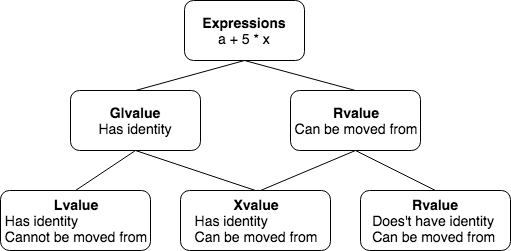

# Move Semantics
The main benefit rvalue references bring to most programmers is not the opportunity to write code using them. Rather, it is the opportunity to use library code that utilizes rvalue references to implement move semantics. For example, the STL classes now have copy constructors, move constructors, copy assignment operators, and move assignment operators.
## Values Categories
Each C++ __expression__ (an operator with its operands, a literal, a variable name, etc. Note: value categories do not refer to variable categories, but refer to expression categories. [JL]) is characterized by two independent properties: a __type__ and a __value category__. In practice we usually only concern two types, __rvalue__ and __lvalue__.   

Full legal descriptions of value category:   
<a href="http://en.cppreference.com/w/cpp/language/value_category">http://en.cppreference.com/w/cpp/language/value_category</a>  

#### lvalue
******
An lvalue is an expression, such as a variable name or a dereferenced pointer, that represents data for which the program __can obtain an address__. Originally, an lvalue was one that could appear on the left side of an assignment statement.

```cpp
// Lvalues can appear on the left side of
// the built-in assignment operator:
a = 0;
// The address of lvalues can be taken:
int* a_ptr = &a;
// Lvalues can bind to lvalue references:
int& a_ref = a;
// Function call returning lvalue reference:
int& bar() { static int i = 0; return i; }
&bar();
bar() = 5;
```
#### rvalue
******
Rvalue reference, indicated by using &&, can bind to rvalues—that is, values that can appear on the right-hand side of an assignment expression but for which one cannot apply the address operator.

Example of rvalues:
```cpp
int x = 10;
int y = 23;
// Rvalues can NOT appear on the left side of
// the built-in assignment operator:
5 = 0;
bar() = 0;
// The address of rvalues can NOT be taken:
&5;
&bar();
// Rvalues do NOT bind to lvalue references:
int& lv_ref0 = 5;
int& lv_ref1 = bar();
// Rvalues bind to rvalue references. Interestingly, binding an rvalue to an rvalue
// reference results in the value being stored in a location whose address can be
// taken.That is, although you can’t apply the & operator to 13, you can apply it to r1.
int && r1 = 13;
// r2 really binds to is the value to which x + y evaluates at that time.
// That is, r2 binds to the value 23, and r2 is unaffected by subsequent changes to x or y.
int && r2 = x + y;
// Function returning non-reference value
int bar() { return 5; }
double && r3 = bar();
```

#### The Fuller Picture in C++11
******
The following is a very brief summary of value categorization in c++11. The graph may help you when we read std container library documents in the future.   


With the introduction of move semantics in C++11, value categories were redefined to characterize two independent properties of expressions:
1. __Has identity__: it's possible to determine whether the expression refers to the same entity as another expression, such as by comparing addresses of the objects or the functions they identify (obtained directly or indirectly);
2. __Can be moved from__: move constructor, move assignment operator, or another function overload that implements move semantics can bind to the expression.   

In C++11, expressions that:  
* Have identity and cannot be moved from are called __lvalue__ expressions.
* Have identity and can be moved from are called __xvalue__ expressions.
* Do not have identity and can be moved from are called __prvalue__ ("pure rvalue") expressions.
* Do not have identity and cannot be moved from are not used

The expressions that have identity are called "glvalue expressions" (glvalue stands for "generalized lvalue"). Both lvalues and xvalues are glvalue expressions. The expressions that can be moved from are called "rvalue expressions". Both prvalues and xvalues are rvalue.

## Move Semantics and the Rvalue Reference
Let’s look into the copying process as it worked prior to C++11. Suppose we start with something like this:

```cpp
vector<string> vstr;
// build up a vector of 20,000 strings, each of 1000 characters ...
vector<string> vstr_copy1(vstr); // make vstr_copy1 a copy of vstr
```
20,000,000 characters will be copied from the memory controlled by vstr to the memory controlled by vstr_copy1. Lots of work! If vstr is not needed ever after being copied to vstr_copy1, wouldn’t it be better if the compiler could just transfer ownership of the data to vstr_copy2?

Since c++11, move constructors are introduced:
```cpp
vector( const vector& other );
vector( vector&& other );
```

#### A Move Examples
******
The following is example (shortten) given in the book of C++ primer plus. Notice how the move constructor nullified memory controlled by the passed-in parameter f. The same considerations that make move semantics appropriate for constructors make them appropriate for assignment.

__Also notice the move  operator parameter is not a const reference because the method alters the source object.__
```cpp
#include <iostream>
using namespace std;
class Useless {
private:
  int n; // number of elements
  char * pc; // pointer to data
  static int ct; // number of objects
public:
  Useless();
  explicit Useless(int k);
  Useless(int k, char ch);
  Useless(const Useless & f);
  Useless operator+(const Useless & f)const;
};

Useless::Useless(const Useless & f): n(f.n) {
  ++ct;
  pc = new char[n];
  for (int i = 0; i < n; i++)
  pc[i] = f.pc[i];
}

Useless::Useless(Useless && f): n(f.n) {
  ++ct;
  f.pc = nullptr; // give old object nothing in return
  f.n = 0;
  ShowObject();
}
Useless & Useless::operator=(const Useless & f) // copy assignment
{
  if (this == &f)
  return * this;
  delete [] pc;
  n = f.n;
  pc = new char[n];
  for (int i = 0; i < n; i++)
  pc[i] = f.pc[i];
  return * this;
}

Useless & Useless::operator=(Useless && f) { // move assignment
  if (this == &f) return * this;
  delete [] pc; n = f.n;
  pc = f.pc;
  f.n = 0;
  f.pc = nullptr;
  return * this;
}

// application
int main()
{
  Useless one(10, 'x');
  Useless two = one;
  Useless three(20, 'o');0
  Useless four (one + three); // calls operator+(), move constructor
}
```

#### Forcing a Move
******
What if you want to move a lvalue? C++11 provides a simpler way to do this—use the __std::move()__ function, which is declared in the utility header file. `std::move()` is equivalent to the following:
```cpp
static_cast<typename std::remove_reference<T>::type&&>(t)
```
See it in action:
```cpp
int main() {
  Useless one(10, 'x');
  Useless two = one +one; // calls move constructor
  Useless three, four;
  three = one; // automatic copy assignment
  four = one + two; // automatic move assignment
  four = std::move(one); // forced move assignment
}
```
One very important thing to understand is that `std::move` doesn't actually "move" anything: it simply casts an expression to an rvalue.
```cpp
void noop_example()
{
    std::vector<int> v0{1, 2, 3, 4, 5};
    std::move(v0); // No-op.
    v0.size(); // Perfectly safe.
}
```
We should realize that the std::move() function doesn’t necessarily produce a move operation. Suppose, for instance, that Chunk is a class with private data and that we have the following code:
```cpp
Chunk one;
...
Chunk two;
two = std::move(one); // move semantics?
```
If the Chunk class doesn’t define a move assignment operator, the compiler will use the copy assignment operator. And if that also isn’t defined, then assignment isn’t allowed at all.

#### Binding & Function Overloading
******
An rvalue can bind to both const lvalue reference and rvalue reference. Suppose we have overloaded function as follows. Which foo() will be called?
```cpp
void foo(int && x) {cout << "rvalue reference foo called\n";}
void foo(const int & x) {cout << "const lvalue reference foo called\n";}
int main() {
    foo(std::move(x)); // 2nd foo()
    foo(5); // 2nd foo()
}
```
More formally:
* An rvalue may be used to initialize a __const lvalue reference__, in which case the lifetime of the object identified by the rvalue is extended until the scope of the reference ends.
* An rvalue may be used to initialize an __rvalue reference__, in which case the lifetime of the object identified by the rvalue is extended until the scope of the reference ends.
* When used as a function argument and when two overloads of the function are available, one taking rvalue reference parameter and the other taking lvalue reference to const parameter, an rvalue binds to the rvalue reference overload (thus, if both copy and move constructors are available, an rvalue argument invokes the move constructor, and likewise with copy and move assignment operators).

#### Move Semantics & Return Statement
******
In the following code snippet, the std::move on tmp is unnecessary and can actually be a performance pessimization as it will inhibit return value optimization.
```cpp
std::vector<int> return_vector(void)
{
    std::vector<int> tmp {1,2,3,4,5};
    return std::move(tmp);
}
std::vector<int> &&rval_ref = return_vector();
```
Best Practice:
```cpp
std::vector<int> return_vector(void)
{
    std::vector<int> tmp {1,2,3,4,5};
    return tmp;
}
std::vector<int> rval_ref = return_vector();
```
There is one case returning rvalue reference makes sense. That is, if you want to return a struct/class member variable, RVO is not performed([stackoverflow reference](https://stackoverflow.com/questions/28066777/const-and-specifiers-for-member-functions-in-c?utm_medium=organic&utm_source=google_rich_qa&utm_campaign=google_rich_qa)).
```cpp
struct Beta {
  Beta_ab ab;
  Beta_ab const& getAB() const& { return ab; }
  Beta_ab && getAB() && { return move(ab); }
  // second "&&" above is member function ref-qualifiers, also added in c++11!
  // Note that move in this case is not optional, because ab is
  // neither a local automatic nor a temporary rvalue.
};
Beta_ab ab = Beta().getAB(); // invoke move
```

#### Practical Use of std::move
******
Many, if not all, of std containers are move-aware.
```cpp
// std::vector::push_back
void push_back( const T& value );
void push_back( T&& value );

// std::vector::operator=
vector& operator=( const vector& other );
vector& operator=( vector&& other );

// std::vector::vector
vector( const vector& other );
vector( vector&& other );
```

The entire container can be moved to a destination, or items can be moved inside the containers.

```cpp
// Moves whole container
std::vector<foo> v;
auto v_copy = v;
auto v_move = std::move(v);

// Moves the temporary inside the vector.
v.push_back(foo{});

foo f;
// Copies `f` inside the vector.
v.push_back(f);
// Moves `f` inside the vector.
v.push_back(std::move(f));
```

Another example:
```cpp
std::vector<int> get_vector(int x);
void consume_vector(std::map<int, std::vector<int>> m);

std::map<int, std::vector<int>> map_of_vector;
for(int i = 0; i < 100; ++i)
{
    // invoke vector move assignment operator
    map_of_vector[i] = get_vector(i);
}
// invoke map move constructor operator
consume_vector(std::move(map_of_vector));
```

Some classes provided by the Standard Library can only be moved.
```cpp
std::thread t{[] { std::cout << "hello!"; }};
// auto t_copy = t; // Does not compile.
auto t_move = std::move(t);

std::unique_ptr<int> up = std::make_unique<int>(1);
// auto up_copy = up; // Does not compile.
auto up_move = std::move(up);
```

#### Pass-by-Value and Move Idiom
******
What's the problem? Consider the following constructor for class Person.
```cpp
struct Person
{
    std::string name;
    Person(const std::string& name) : name{name} {} // 1 Copy
    Person(std::string&& name) : name{std::move(name)} {} // 1 Move
};
```
The code is optimal for users of the class. However, if the number of parameters are N, we need to write 2^N overloaded constructor. Ouch! That's when the "pass-by-value and move" comes in handy.
```cpp
struct Person
{
    std::string name;
    // * Lvalue => 1 copy + 1 move
    // * Rvalue => 2 moves
    // Move is cheap; close to optimal
    Person(std::string name) : name{std::move(name)} {}
};
```
