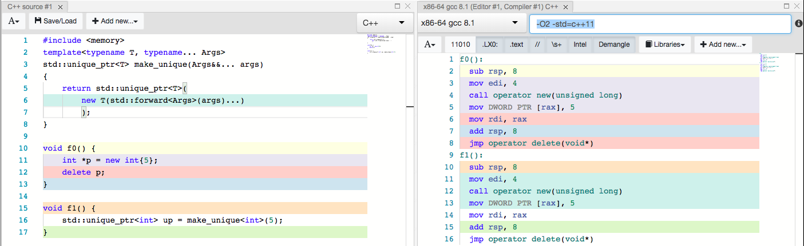

Smart Pointers
======
Problems:
+ Forget to use delete - memory leak
+ Use delete multiple times - double free
+ Use the pointer after delete is also dangerous

The smart pointer template classes defines class object that acts like a pointer but has additional features. We can think of the pointer has a destructor defined, which frees the memory it controlled upon expiration of the pointer object. In C++ there are __std::unique_ptr__, __std::shared_ptr__, __std::weak_ptr__ and __std::auto_ptr__. auto_ptr is deprecated in C++11. So it will not be covered in this document.

Each of these classes has an explicit constructor taking a pointer as an argument. Thus, there is no automatic type cast from a pointer to a smart pointer object:
```cpp
std::shared_ptr<double> pd;
double *p_reg = new double;
pd = p_reg; // not allowed (implicit conversion)
pd = std::shared_ptr<double>(p_reg); // allowed (explicit conversion )
std::shared_ptr<double> pshared = p_reg; // not allowed (implicit conversion)
std::shared_ptr<double> pshared(p_reg); // allowed (explicit conversion)
```

The smart pointer template classes are defined so that in most respects a smart pointer object acts like a regular pointer. For example, given that ps is a smart pointer object, you can dereference it (`*ps`), use it to access structure members (`ps->puffIndex`).

To use smart pointers, the `<memory>` header must be included.
## Unique pointer
`std::unique_ptr<T>` is a __move-only__ class that represents unique ownership over a dynamically allocated object.
```cpp
struct foo
{
    foo()  { std::cout << "Constructor called." << std::endl;  }
    ~foo() { std::cout << "Destructor called." << std::endl; }
};
int useSmart() {
  std::unique_ptr<foo> f{new foo};
}
```
When the `std::unique_ptr` instance `f` goes out of scope, it will automatically call `delete` for us, making sure that we do not forget to free the previously-allocated memory.

The uniqueness of std::unique_ptr is implemented through deleting copy assignment operator and copy constructor.
```cpp
int useSmart() {
  std::unique_ptr<foo> f{new foo};

  // Won't compile!
  // auto f2 = f;

  // Need to convert f to rvalue reference
  auto f2 = std::move(f);
}
```
#### Unique pointer and functions
******
Examples of returning/accepting `std::unique_ptr` instances from/to functions.
```cpp
std::unique_ptr<foo> bar()
{
    std::unique_ptr<foo> f{new foo};
    return f;
}

void take_ownership(std::unique_ptr<foo> f)
{
    std::cout << "took ownership of `f`\n";
}

int main()
{
    ownership_transfer();
    std::cout << "\n";

    auto f = bar();
    take_ownership(std::move(f)); // Need to use std::move, otherwise f is lvalue
}
```
#### Runtime overhead
******
std::unique_ptr can be thought as a zero-cost abstract. Refer to the following comparison of assembly codes:

#### Exception-safety
******
There's no such guarantee in the evaluation order in C++ function parameters([Reference](https://stackoverflow.com/a/2934909/6585344)). Consider the following codes:
```cpp
void foo(std::unique_ptr<int>, int);
int bar() { throw std::runtime_error{"whoops!"}; }
int main()
{
    foo(std::unique_ptr<int>{new int{5}}, bar());
}
```
The evaluation order for function parameters of foo() can be any of the following:

Order #0:
* Allocate memory for `new int{5}`
* Construct `unique_ptr`
* Invoke `bar()` and throw

Order #1:
* Invoke `bar()` and throw
* Allocate memory for `new int{5}`
* Construct `unique_ptr`

Order #2:
* Allocate memory for `new int{5}`
* Invoke `bar()` and throw
* Construct `unique_ptr`

We see that if order #2 take place, then we have memory leak. In C++14, std::make_unique is introduced to solve this issue.
```cpp
// Template declaration of std::make_unique
template< class T, class... Args >
unique_ptr<T> make_unique( Args&&... args );

foo(std::make_unique<int>(5), bar());
```
The arguments args are passed to the constructor of T, thus avoiding extra level of evaluation. Hence, `std::make_unique` above will not interleave an allocation with the call to `bar()`. However, in C++11 std::make_unique is not defined yet, therefore we need to make our own make_unique if our funtion contain more than one parameters other than make_unique and they can throw.
```cpp
// Defining your own make_unique;
// Remember to put it into a namespace other than std!
template<typename T, typename... Args>
std::unique_ptr<T> make_unique(Args&&... args)
{
    return std::unique_ptr<T>(new T(std::forward<Args>(args)...));
}
```
## Shared Pointer
`std::shared_ptr<T>` Manages the storage of a pointer, providing a limited garbage-collection facility, possibly sharing that management with other objects. It is a __copyable class__ that represents shared ownership over a dynamically allocated object. It uses __"reference counting"__ to keep track of how many alive owners are present and releases the memory when that count reaches zero.

+ Copying a `std::shared_ptr` shares ownership: increase `use_count`.
+ Moving a `std::shared_ptr` transfers ownership: does not increase `use_count`.

#### Constructing shared pointer
******
__Top line__: prefer using std::make_shared instead of constructing std::shared_ptr using raw pointer.

It's legal to construct std::shared_ptr from raw pointer:
```cpp
std::shared_ptr<int> s0{new int{5}};
```
However, it's more ideal to use std::make_shared to construct std::shared_ptr, for the following reason:
+ Prevents memory leaks due to unspecified order of evaluation (just as explained in std::unique_ptr)
+ Prevents an unnecessary additional allocation and improves cache locality.

```cpp
auto s1 = std::make_shared<int>(5);
```
For the 2nd point, compared with `std::shared_ptr<int> s0{new int{5}};`, constructing std::shared_ptr using raw pointer forces the compiler to perform allocation twice.
* Once for the `int`
* Once for the `shared_ptr`'s control block

This is wasteful, as both allocations could be coalesced into one. `std::make_shared` allows implementations to only allocate once for both the shared object and the control block. Having one allocation has the additional benefit of cache locality. Plus, std::make_shared is available in C++11, unlike std::make_unique.

It's also possible to construct a std::shared_ptr by moving ownership from std::unique_ptr to std::shared_ptr. The std::unique_ptr being moved from manages no object after the call.

```cpp
unique_ptr<Foo> u(new Foo);
shared_ptr<Foo> f = move(u);
```

#### Runtime overhead
******
Check out the comparison of compiled codes here: [Link](https://godbolt.org/g/Khj7Yn).
`std::shared_ptr` has time overhead in constructor (to create the reference counter), in destructor (to decrement the reference counter and possibly destroy the object) and in assignment operator (to increment the reference counter). Due to thread-safety guarantees of std::shared_ptr, these increments/decrements are atomic, thus adding some more overhead.
#### More on thread safety
******
std::shared_ptr can work in multiple threads, provided each thread has __its own copy or copies__. In this case, the changes to the reference count are indeed synchronized(but it's our responsibility that make sure what we do with the shared data is correctly synchronized).
+ Standard guarantees reference counting is handled thread safe and it's platform independent
+ Standard guarantees that only one thread (holding last reference) will call delete on shared object
+ shared_ptr does not guarantee any thread safety for object stored in it?


But if multiple threads of execution access the same shared_ptr instance without synchronization and any of those accesses uses a non-const member function of shared_ptr then a data race will occur; the shared_ptr overloads of atomic functions can be used to prevent the data race.

## Weak Pointer
std::weak_ptr can be thought of as an __observer__ to an object that is managed by std::shared_ptr. It must be converted to std::shared_ptr in order to access the referenced object.
+ `std::weak_ptr` can only be constructed from instances of `std::shared_ptr` or other weak pointers.
+ `std::weak_ptr::lock` must be called to in order to access the referenced object: it return a new std::shared_ptr that shares ownership of the managed object.

```cpp
#include <iostream>
#include <cassert>
#include <memory>

// `std::weak_ptr` can only be constructed from
// instances of `std::shared_ptr` or other weak
// pointers.

// http://en.cppreference.com/w/cpp/memory/weak_ptr

// Weak pointers can be used to check whether or
// not an object managed by `shared_ptr` is alive:
void checking_existence()
{
    std::weak_ptr<int> wp;

    assert(wp.use_count() == 0);
    assert(wp.expired());

    {
        auto sp = std::make_shared<int>(42);
        wp = sp;

        assert(wp.use_count() == 1);
        assert(!wp.expired());

        auto sp2 = sp;

        assert(wp.use_count() == 2);
        assert(!wp.expired());
    }

    assert(wp.use_count() == 0);
    assert(wp.expired());
}

// Accessing an object through an `std::weak_ptr`
// requires a conversion to `std::shared_ptr`
// first:
void accessing_objects()
{
    // http://en.cppreference.com/w/cpp/memory/weak_ptr/lock

    std::weak_ptr<int> wp;
    assert(wp.lock() == nullptr);

    auto sp = std::make_shared<int>(42);
    wp = sp;
    assert(* wp.lock() == 42);
}

int main()
{
    checking_existence();
    accessing_objects();
}

```

As an observer, std::weak_ptr does not increase the `use_count` of the std::shared_ptr it observes. The property makes it possible to use std::weak_ptr to break circular references of std::shared_ptr.

#### Circular references of shared pointer
******
We saw how std::shared_ptr allowed us to have multiple smart pointers co-owning the same resource. However, in certain cases, this can become problematic. Consider the following case, where the shared pointers in two separate objects each point at the other object.

```cpp
#include <iostream>
#include <memory> // for std::shared_ptr
#include <string>

class Person
{
	std::string m_name;
	std::shared_ptr<Person> m_partner; // initially created empty

public:

	Person(const std::string &name): m_name(name)
	{
		std::cout << m_name << " created\n";
	}
	~Person()
	{
		std::cout << m_name << " destroyed\n";
	}

	friend bool partnerUp(std::shared_ptr<Person> &p1, std::shared_ptr<Person> &p2)
	{
		if (!p1 || !p2)
			return false;

		p1->m_partner = p2;
		p2->m_partner = p1;

		std::cout << p1->m_name << " is now partnered with " << p2->m_name << "\n";

		return true;
	}
};

int main()
{
	auto lucy = std::make_shared<Person>("Lucy"); // create a Person named "Lucy"
	auto ricky = std::make_shared<Person>("Ricky"); // create a Person named "Ricky"

	partnerUp(lucy, ricky); // Make "Lucy" point to "Ricky" and vice-versa

	return 0;
}
```
Try running the codes above and we see that `lucy` and `ricky` is never destructed. To break the circular dependency, use `std::weak_ptr<Person>` for `Person`'s member `m_partner`. The rest of the codes are not changed. This time we will see that both `lucy` and `ricky` are destructed when the shared pointer for them expires.

```cpp
class Person
{
	...
	std::weak_ptr<Person> m_partner; // note: This is now a std::weak_ptr
  ...
};
```
